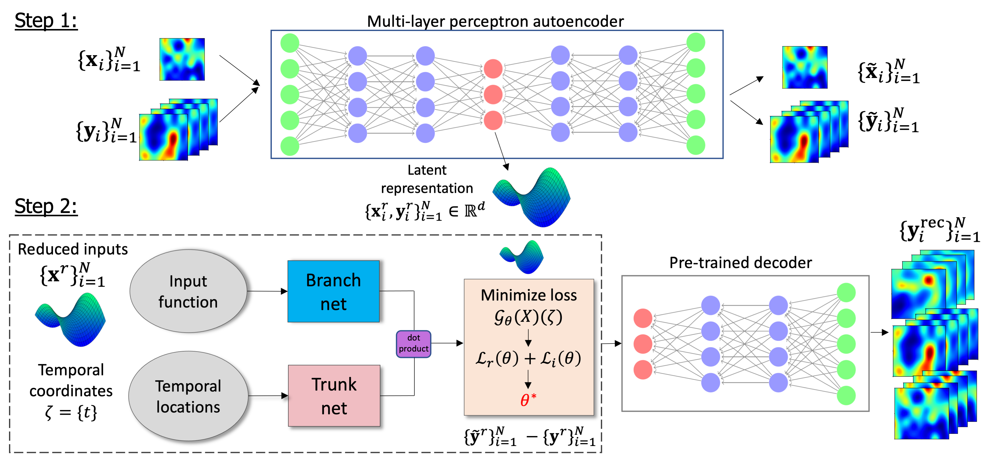

## Table of contents
* [General info](#general-info)
* [Methods-pipeline](#methods-pipeline)
* [Examples](#examples)
* [Contents](#contents)
* [Getting started](#getting-started)
* [Demonstration](#demonstration)

## General info

This Git repository contains python codes for implementing the Latent DeepONet model proposed here:   
Latent DeepONet leverages auroencoder models with the operator regressor DeepONet, to learn operators on latent spaces by leveraging the intrinsic dimensionality of physics-based data. 

The code has the following capabilities:  
* Perform operator regression for PDE problems of very high dimensionality (e.g., high-dimensional time-dependent PDEs)
* Compare the performance of latent DeepONet for different autoencoder models. The current version includes the following models:   
    1. **Autoencoder** (vanilla-AE)  
    2. **Multi-Layer Autoencoder** (MLAE)
    3. **Convolutional Autoencoder** (CAE) and
    4. **Wasserstein Autoencoder** (WAE)
* Train latent DeepONet for different values of the latent dimension (*d*) and compare results with the standard DeepONet trained on the full-dimensional data.

## Methods-pipeline

Details of the methdology can be found in the published paper here.

Below, a **graphical summary** of the method is provided:

<p align="center">
    
</p>

<!---
## Application

Three illustrative examples are provided. The first considers a material fracture problem. The second corresponds to the Rayleigh-Benard convective flow where a thin fluid layer is heated from below and instability occurs due to temperature gradient. Finally, the third example considers the spherical shallow-water equations which model large scale atmospheric flows. The codes provided can be implemented to any dataset generated by a time-dependent PDE, however here they demonstrate the method for the shallow-water equation. 
 

--->

## Contents

Each folder contains the following codes adjusted for each application:

* ```AE.py``` - Contains all AE classes and code to train Autoencoders

* ```DON.py``` - Containts all DON classes and code to train latent DeepONet

* ```plot.py``` - Generates plots with comparative results for all methods and latent dimensions

* ```main.py``` - Demonstrates how to generate results for multiple methods and latent dimensions

```generate-data.py``` - Code to generate the shallow-water equation data using the [Dedalus Project](https://dedalus-project.readthedocs.io/en/latest/index.html).


## Getting started

**1.** Create an Anaconda Python 3.8 virtual environment:
```
conda create -n latent_don python==3.8.13  
conda activate latent_don
```

**2.** Clone our repo:

```
git clone https://github.com/katiana22/latent-deeponet.git
```

**3.** Install dependencies via ```pip``` with the following commands: 

```
cd latent-deeponet 
pip install -r requirements.txt
``` 

or  

Install the entire conda environment:

```
conda env create -f environment.yml
```

## Demonstration  

To train an autoencoder model following by the training of L-DeepONet with the reduced data run the following on the terminal:

```
python AE.py --method CAE --latent_dim 16 --n_samples 800 --n_epochs 1000  --ood 1 --noise 1   
python DON.py --method CAE --latent_dim 16 --n_samples 800 --n_epochs 1000 --ood 1 --noise 1
```

In the example above, we chose to run L-DeepONet with a CAE, a latent dimensionality of 16, 800 in total train/test sampels and choose 1 for **ood** and **noise** which will generate results for out-of-distribution and noisy data.

One can also use the script ```main.py``` to generate results for multiple methods (e.g., vanilla-AE, MLAE, CAE), latent dimensions (e.g., 16,25,81) and random seed numbers via the *reps* variable (e.g., run 5 times each with a loop) and generate comparative violin plots via the ```plot.py```. 


## Citation  

### Mainteners
[Katiana Kontolati](https://katiana22.github.io/)

:email: : kontolati@jhu.edu


